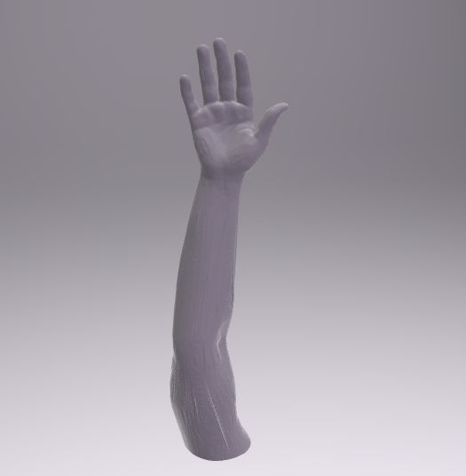
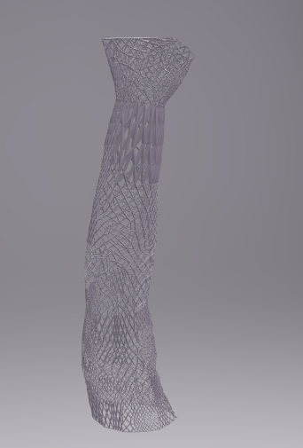

# P2 – Tworzenie modeli wyrobów medycznych
## Dedykowane unieruchomienie ortopedyczne na bazie modelu ręki

**Przedmiot:** Tworzenie wyrobów medycznych (2026L)
**Zadanie:** P2 – projekt spersonalizowanego usztywnienia ortopedycznego zaprojektowanego
na podstawie zrekonstruowanej z danych DICOM powierzchni prawej ręki pacjenta.

---

## 1. Opis scenariusza klinicznego

Pacjent doznał złamania dalszej części kości promieniowej prawej ręki, bez przemieszczenia.
Po nastawieniu złamania konieczne jest zastosowanie unieruchomienia w celu zapewnienia
prawidłowego procesu gojenia. Celem zadania jest zaprojektowanie i wydrukowanie w technologii
3D dedykowanego, spersonalizowanego unieruchomienia,
dopasowanego indywidualnie do anatomii pacjenta na podstawie danych obrazowych (CT/DICOM).

## 2. Zawartość repozytorium

| Plik | Opis |
|---|---|
| `21255_reka.stl` | Oczyszczony, wygładzony i wypełniony model powierzchni całej prawej ręki, wyselekcjonowany z danych `NormalRightArmDICOM.zip`. Stanowi anatomiczną podstawę do projektowania usztywnienia. |
| `21255_Cast.stl` | Model 3D dedykowanego unieruchomienia ortopedycznego zaprojektowany na bazie powierzchni modelu ręki. |
| `reka.png` | Zrzut ekranu poglądowy modelu ręki (widok renderowany). |
| `cast.png` | Zrzut ekranu poglądowy modelu usztywnienia z widoczną strukturą kratownicową otworów. |
| `P2___Tworzenie_modeli_wyrobów_medycznych__-_2026L.pdf` | Oryginalna treść zadania. |

## 3. Przebieg prac

### 3.1. Segmentacja i przygotowanie modelu ręki
- Z danych medycznych `NormalRightArmDICOM.zip` wyselekcjonowano prawą rękę (segmentacja tkanki/skóry).
- Powierzchnię oczyszczono z artefaktów, wygładzono oraz wypełniono ubytki, uzyskując zamknięty,
  drukowalny model bryłowy.
- Zweryfikowano wymiary anatomiczne modelu względem wymiarów kalibrujących naniesionych
  na dodatkowych ujęciach z danych źródłowych, aby wykluczyć błędy skalowania powstałe
  podczas konwersji formatów.
- Gotowy model wyeksportowano do pliku `21255_reka.stl`.

### 3.2. Import i weryfikacja skali w Fusion 360
- Model ręki zaimportowano do pustego projektu w programie Autodesk Fusion.
- Sprawdzono zgodność wymiarów modelu z rzeczywistymi danymi anatomicznymi w skali 1:1,
  korygując ewentualne rozbieżności wynikające z konwersji jednostek.

### 3.3. Modelowanie unieruchomienia
Na bazie zweryfikowanej powierzchni ręki zaprojektowano usztywnienie w następujących krokach:

a) **Powierzchnia usztywnienia** – utworzona przez nałożenie offsetu na powierzchnię modelu ręki,
   uzyskując cienką warstwę ochronną o grubości ok. 3–5 mm.

b) **Zasięg unieruchomienia** – struktura obejmuje staw nadgarstkowy oraz całą dalszą część
   przedramienia: rozpoczyna się na poziomie głów kości śródręcza, a kończy tuż poniżej
   zgięcia łokciowego, zapewniając stabilizację złamanej kości promieniowej.

c) **Wzór kratownicowy** – w strukturze wycięto otwory w układzie siatki trójkątnej
   w celu redukcji masy i poprawy wentylacji skóry pod usztywnieniem. Odstępy między otworami
   utrzymano w zakresie 5–15 mm.

d) **Balans masa/wytrzymałość** – gęstość i skalę otworów dobrano tak, aby zachować kompromis
   między lekkością konstrukcji a jej wytrzymałością mechaniczną.

e) **Wykończenie** – krawędzie modelu zamknięto i wygładzono, tak aby wyrób szczelnie i stabilnie
   otaczał rękę wraz ze stawem nadgarstkowym, bez elementów montażowych (prototyp – łączenia
   zostałyby dodane na dalszym etapie projektowania).

Gotowy model wyeksportowano do pliku `21255_Cast.stl`.

## 4. Podgląd modeli

- **Model ręki** (`reka.png`) – wyeksportowana, wygładzona powierzchnia całej prawej ręki
  (dłoń w pozycji z rozprostowanymi palcami, przedramię do okolic łokcia).

  

- **Model usztywnienia** (`cast.png`) – widoczna cienka powłoka otaczająca przedramię i nadgarstek,
  perforowana wzorem kratownicowym w celu redukcji masy i zapewnienia wentylacji.

  

## 5. Wykorzystane narzędzia

- Segmentacja/rekonstrukcja z DICOM – (3D Slicer / odpowiednik używany na ćwiczeniach L1–L3)
- Modelowanie CAD – Autodesk Fusion
- Zaprojektowanie Cast'a w Blenderze

## 6. Materiały źródłowe

1. Instruktaż modelowania w Blenderze – wideo YouTube.
